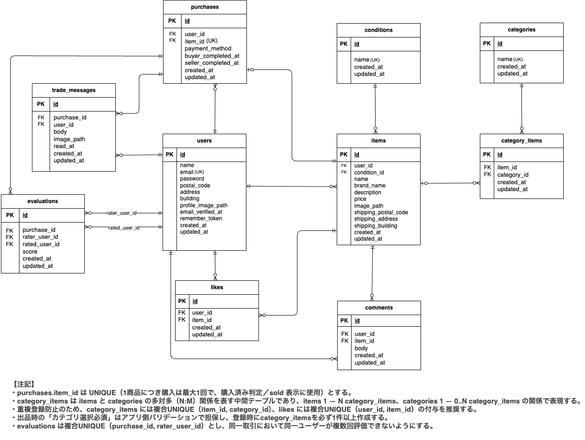

# アプリケーション名

COACHTECH 模擬案件として作成したフリマアプリです。
ユーザーが商品を出品・購入できるほか、いいね・コメント機能、
取引メッセージ機能および取引完了後の評価機能を実装しています。

---

## 環境構築

本アプリケーションは Docker を使用して Laravel / MySQL 環境を構築します。
以下の手順に沿ってセットアップしてください。

### Docker ビルド

- git clone https://github.com/amihira03/coachtech-furima.git
- cd coachtech-furima
- cp src/.env.example src/.env
- docker compose up -d --build

### Laravel 環境構築

- docker compose exec php bash
- composer install
- php artisan key:generate
- php artisan storage:link
- php artisan migrate --seed

## ダミーデータについて

本アプリケーションでは、商品データおよびユーザーデータをシーディングにより投入しています。
商品データは「商品データ一覧」に準拠した内容で作成しています。

### 商品画像について

商品画像は `public/images/items` ディレクトリに配置しています。
Seeder により商品データと紐づく形で表示されます。

### ユーザーデータ

以下の3ユーザーをダミーデータとして登録しています。

- 出品者A
  - メールアドレス：`seller_a@example.com`
  - パスワード：`password`

- 出品者B
  - メールアドレス：`seller_b@example.com`
  - パスワード：`password`

- ユーザーC
  - メールアドレス：`user_c@example.com`
  - パスワード：`password`

出品商品は以下の通りです。

- 出品者A：商品ID CO01〜CO05 を出品
- 出品者B：商品ID CO06〜CO10 を出品
- ユーザーC：何も紐づけられていないユーザー

## 開発環境（URL）

- 商品一覧（トップ）：http://localhost/
- 商品一覧（マイリスト）：http://localhost/?tab=mylist
- 会員登録：http://localhost/register
- ログイン：http://localhost/login
- 商品詳細：http://localhost/item/{item_id}
- 商品購入：http://localhost/purchase/{item_id}
- 取引画面：http://localhost/trades/{purchase_id}
- 送付先住所変更：http://localhost/purchase/address/{item_id}
- 商品出品：http://localhost/sell
- マイページ：http://localhost/mypage
- プロフィール編集：http://localhost/mypage/profile
- 購入した商品一覧：http://localhost/mypage?page=buy
- 出品した商品一覧：http://localhost/mypage?page=sell
- phpMyAdmin：http://localhost:8080

※ {item_id},{purchase_id} は数字に置き換えてください（例：/item/1）

---

## 使用技術（実行環境）

- PHP：8.1（php:8.1-fpm）
- Laravel：8.75
- MySQL：8.0.26（platform: linux/amd64）
- Nginx：1.21.1
- Docker：Docker Desktop
- 認証：Laravel Fortify
- バリデーション：FormRequest

---

## 認証について（アクセス制御）

- 未認証でも閲覧可能
  - 商品一覧（トップ）`/`
  - 商品詳細 `/item/{item_id}`
  - 会員登録 `/register`
  - ログイン `/login`
- ログイン必須
  - 商品購入 `/purchase/{item_id}`（GET/POST）
  - 送付先住所変更 `/purchase/address/{item_id}`（GET/PATCH）
  - 商品出品 `/sell`（GET/POST）
  - 取引画面 `/trades/{purchase_id}`
  - マイページ `/mypage`
  - プロフィール編集 `/mypage/profile`（GET/PATCH）

※ マイリスト`/?tab=mylist`は、未認証の場合「何も表示されない」挙動にします。

---

## テスト

本アプリケーションでは Laravel の Feature テストを使用して主要機能の動作確認を行っています。
テスト実行前に、テスト用データベースを作成してください。

```bash
docker compose exec mysql mysql -u root -proot -e "CREATE DATABASE IF NOT EXISTS coachtech_furima_test;"
docker compose exec php bash
php artisan test
```

以下の機能についてテストを実装しています。

- ユーザー登録・ログイン
- 商品一覧・商品詳細
- 商品出品
- いいね機能
- コメント機能
- 商品購入
- 取引メッセージ機能
- 取引評価機能
- 取引完了メール送信

---

### メール送信について

本アプリケーションでは、メール認証機能および取引完了通知メールの確認に MailHog を使用します。

- メール認証：会員登録後に認証メールを送信
- 取引完了通知：購入者が取引完了した際に出品者へ通知メールを送信

MailHog 管理画面：http://localhost:8025

---

### 支払い方法選択・Stripe 決済（応用要件：FN023）

本アプリケーションでは、商品購入時に **Stripe Checkout** を利用した
支払い方法選択機能を実装しています。
※ Stripe のテストカード番号
`4242 4242 4242 4242`（メールアドレス・有効期限(未来の日付)・CVC・名前 は任意で可）

---

## ER 図


